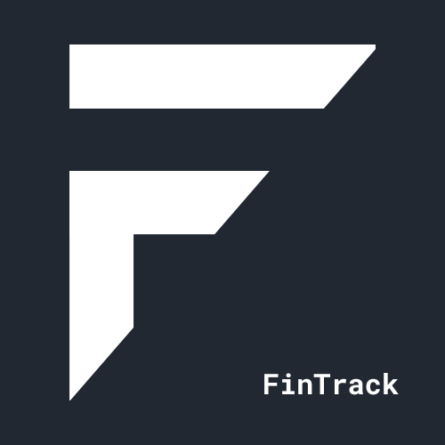

<p align="center">
  <a href="#" target="blank"></a>
</p>

  <p align="center">Track your finances, achieve your goals</p>
  <!--[](https://opencollective.com/nest#backer)
  [](https://opencollective.com/nest#sponsor)-->

# FinTrack API

## Description

FinTrack API is a robust and intuitive expense tracker API designed to empower users to take control of their personal finances. With FinTrack, users can effortlessly track their expenses and incomes, categorize transactions, and generate insightful reports. The API aims to provide a comprehensive solution for personal finance management, making it easy for users to monitor their spending habits, set budgets, and achieve their financial goals.

## Installation

```bash
$ npm install
```

## Running the app

```bash
# development
$ npm run start

# watch mode
$ npm run start:dev

# production mode
$ npm run start:prod
```

## Test

```bash
# unit tests
$ npm run test

# e2e tests
$ npm run test:e2e

# test coverage
$ npm run test:cov
```

## Swagger Documentation

Visit `/docs` and You'll find a swagger API documentation that contains almost all you need to interact with the API.

## Credits

- Author - [Ahsan Azizan](https://ahsanzizan.xyz)
- Website - Not deployed yet
- Nest.js Author - [Kamil Myśliwiec](https://kamilmysliwiec.com)

## License

This project is [MIT licensed](LICENSE).
